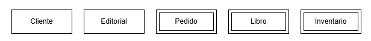
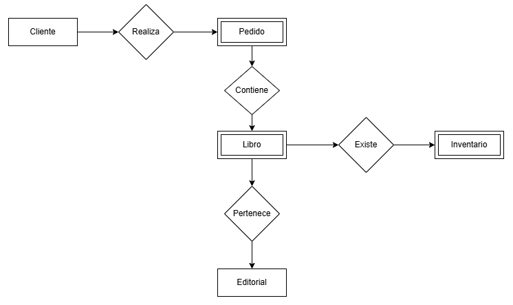
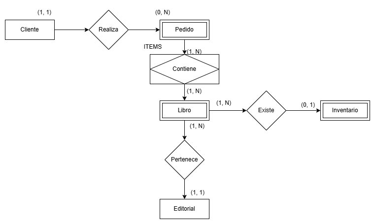
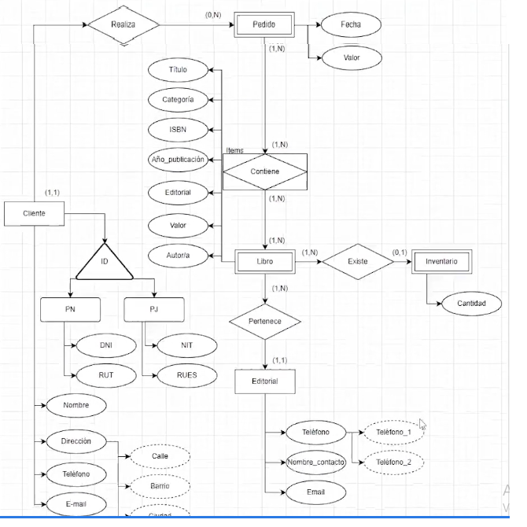

# 🧩 Modelo Entidad-Relación (MER)

Esta carpeta contiene el **Modelo Entidad-Relación (MER)** correspondiente a la etapa conceptual del proyecto.

---

## 📌 Estado del avance

- [x] 1. Modelo Conceptual
- [x] 2. Entidades y tipos
- [x] 3. Modelo y Diagrama Entidad-Relación
- [x] 4. Relaciones y tipos
- [x] 5. Cardinalidad
- [x] 6. Atributos y tipos

---
---

## 1. ¿Qué es el Modelo Conceptual?

El **modelo conceptual** es la primera etapa del diseño de una base de datos, donde se modela el mundo real desde el punto de vista de los datos. Tiene las siguientes características:

- Es **independiente de la implementación** (no depende del hardware, software, ni del SGBD).
- Usa conceptos del **modelo Entidad-Relación (MER)** para representar la información.
- Sirve como **puente entre los requisitos del usuario y el diseño lógico y físico** de la base de datos.

---
---

## 2. ¿Qué es una Entidad?

Una **entidad** es un elemento del mundo real o del negocio que tiene existencia propia dentro del sistema y del cual queremos guardar información estructurada.

Se representan mediante un rectángulo.

> Ejemplo: Cliente, Libros, Editorial, Pedido, Inventario, etc.

### 🧩 2.1. Tipos de Entidades

#### 2.1.1. 🟨 Entidad Fuerte

- **Definición:** Es una entidad que tiene existencia propia, que no depente de otra, y tiene una clave primaria que la identifica de forma única.
- **Ejemplo:**
  - `Cliente`
  - `Editorial`
  
  

#### 2.1.2. 🟦 Entidad Débil

- **Definición:** Es una entidad que **no posee clave primaria propia** y depende de otra entidad para poder identificarse. Se apoya en una clave externa.
- **Ejemplo:**
  - `Libro`: depende de la `Editorial`
  - `Pedido de compra`: depende de un `Cliente` y un `Libro`

#### 2.1.3. 🟩 Entidad de Especialización/Generalización

- Se da cuando una entidad general se divide en subtipos más específicos que comparten atributos comunes, pero también tienen atributos particulares.
- **Ejemplo en este modelo:**
  - Entidad general: `Cliente`
  - Subtipos:
    - `PersonaNatural` (atributos: `DNI`, `RUT`)
    - `PersonaJuridica` (atributos: `NIT`, `RUES`)

---
---

## 3. Diagrama Entidad-Relación (MER) 📊

El diagrama representa las entidades principales del sistema:

- **Cliente** 
- **Editorial**
- **Pedido**
- **Libro**
- **Inventario**

---
---

## 4. Relaciones 🔗 

Las entidades del sistema se relacionan mediante un rombo, se relacionan así:

- Un **Cliente** puede realizar uno o varios **Pedidos**.
- Un **Pedido** puede contener uno o varios **Libros**.
- Un **Libro** puede existir o no en el **Inventario**
- Cada **Libro** pertenece a una única **Editorial**.

### 4.1. Tipos de Relaciones 🔗

- **1 a 1 (1:1):** Poco común, no usada en este modelo.
- **1 a muchos (1:N):** Un cliente puede hacer muchos pedidos.
- **Muchos a muchos (N:M):** Un pedido puede tener varios libros y un libro puede aparecer en varios pedidos.

---
---

## 5. Cardinalidad de las Relaciones 🔢

- **Cliente — Pedido:** 1:N  
  Un cliente puede realizar varios pedidos. Muchos pedidos son realizados por un solo cliente.

- **Editorial — Libro:** 1:N  
  Una editorial puede publicar varios libros. Muchos libros son publicados por una sola editorial.

- **Pedido — Libro:** N:M  
  Un pedido puede incluir varios libros. Un libro puede estar incluido en varios pedidos.

- **Inventario — Libro:** N:1  
  Un libro puede estar referenciado en muchos registros de inventario. Muchos registros de inventario pertenecen a un solo libro.

  - Cada vez que la cardinalidad sea N:M se agrega una Entidad intermedia.
    Para este caso se llama **Items**

---
---

## 6. Atributos y sus tipos 🧾

Los **atributos** son las características o propiedades que describen a una entidad. Cada entidad del sistema contiene uno o más atributos que permiten identificarla y registrar información relevante.

### 6.1. Tipos de Atributos 🔹

### 6.1.1. Atributos Atómicos
- Los atributos atómicos son aquellos que tienen un único valor. 
- **Ejemplo**: El atributo "nombre" es un atributo atómico, ya que solo almacena un único valor.

### 6.1.2. Atributos de Multivalor
- Los atributos de multivalor son aquellos que pueden tener más de un valor lógico.
- **Ejemplo**: El atributo "teléfono" podría ser considerado un atributo de multivalor, ya que se pueden tener múltiples números de teléfono, como "teléfono 1" y "teléfono 2".

### 6.1.3. Atributos Derivados
- Los atributos derivados son aquellos que se derivan de otros atributos.
- **Ejemplo**: El atributo "dirección" puede tener atributos derivados como "calle", "barrio", "ciudad" y "estado", que son componentes de la dirección.

### 6.1.4. Atributos Clave
- Los atributos clave son aquellos que identifican de manera única a una entidad.
- **Ejemplo**: Los atributos "RUT" y "DNI" son ejemplos de atributos clave para una persona natural, mientras que "NIT" y "RUES" son atributos clave para una persona jurídica. Estos atributos son importantes y se diferencian porque suelen estar subrayados.

### Atributos en el Diagrama MER

---