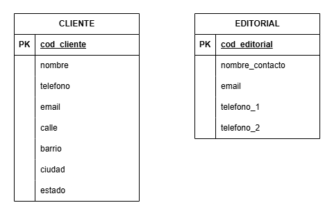
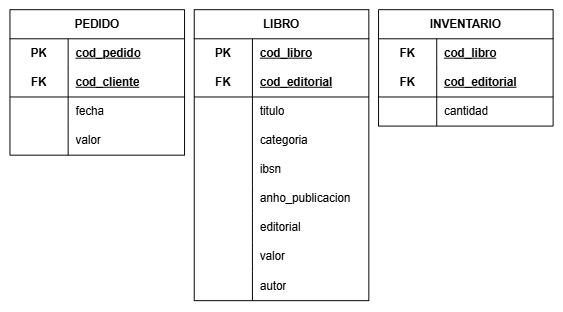
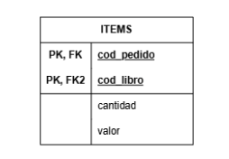
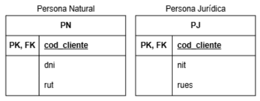

# 🧠 Modelo Lógico de Datos (MLD)

Esta carpeta contiene el **Modelo Lógico de Datos (MLD)** derivado del modelo entidad-relación (MER) previamente desarrollado.

---

## 📌 Estado del avance

- [x] 1. Modelo Lógico
- [x] 2. Entidades Fuertes
- [x] 3. Entidades Débiles
- [x] 4. Entidad Asociativa
- [x] 5. Atributos de Especialización
- [x] 6. Cardinalidad

---
---

## 1. ¿Qué es el Modelo Lógico? 🧾

El **Modelo Lógico de Datos** es una representación más detallada y técnica del modelo conceptual (MER). Se enfoca en **cómo se organizarán los datos** en una base de datos relacional, sin todavía considerar aspectos físicos o tecnológicos.

Se encarga de:
- Especificar tablas lógicas basadas en entidades
- Establecer claves primarias (PK) y foráneas (FK)
- Eliminar redundancias (normalización)
- Preparar el modelo para la implementación física

---
---

## 2. Entidades Fuertes

### Representación de Entidades Fuertes

---
---

## 3. Entidades Débiles

### Representación de Entidades Débiles

---
---

## 4. Entidad Asociativa

**Definición:** Una tabla que se crea para representar **una relación de muchos a muchos** entre dos entidades.

- Ejemplo: La tabla "ITEMS" que conecta "PEDIDO" y "LIBRO".
- Atributos clave:
  - Claves foráneas: "cod_pedido" (de "Pedido") y "código del libro" (de "Libro").
  - Atributos propios: cantidad, valor.

### Representación de Entidad Asociativa

---
---

## 5. Atributos de Especialización

**Definición:** Tablas que se crean para detallar diferentes tipos de una entidad más general.
- Ejemplo: "Persona Natural (PN)" y "Persona Jurídica (PJ)" que especializan la entidad "Cliente".

- Clave foránea común:
  - "cod_cliente" (código del cliente) que relaciona ambas tablas con "Cliente".
- Atributos específicos:
  - Persona Natural (PN): DNI, RUT.
  - Persona Jurídica (PJ): NIT, RUES.

### Representación de Atributos de Especialización

---
